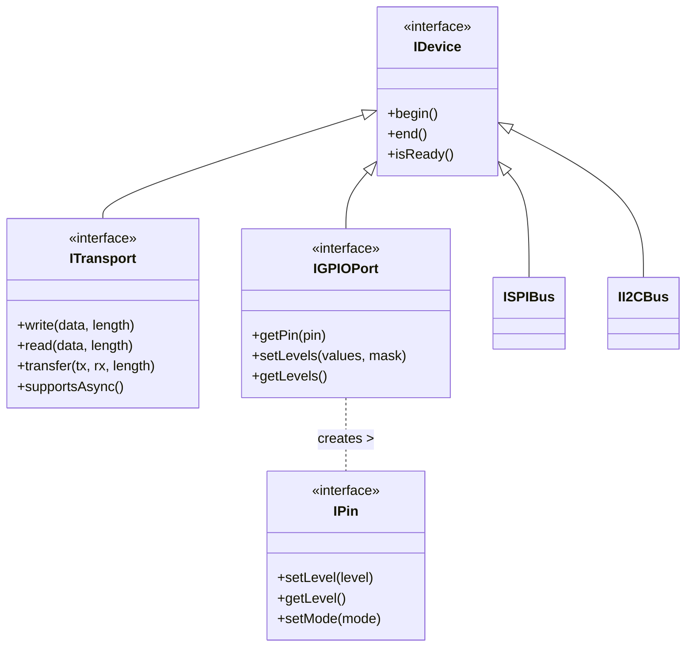
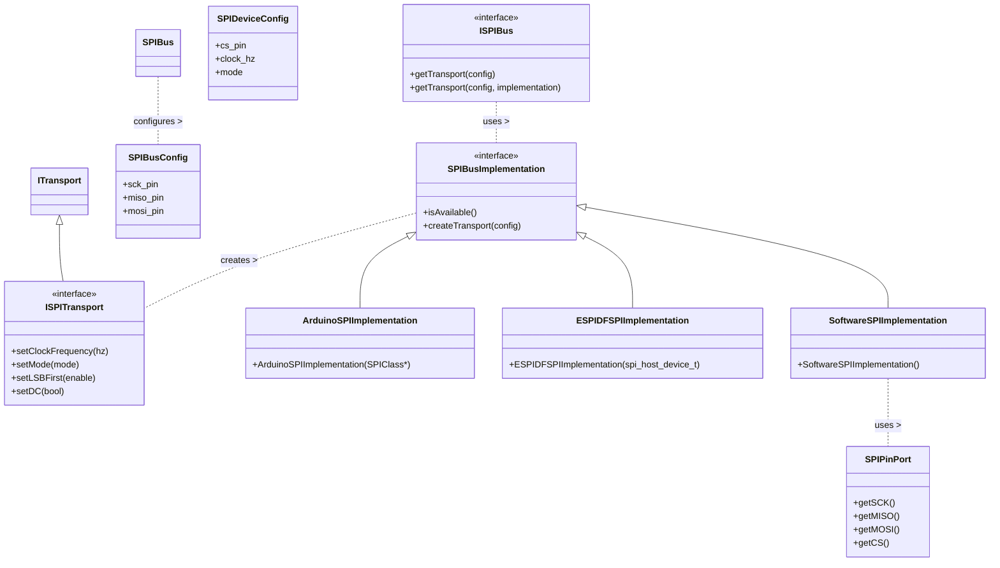
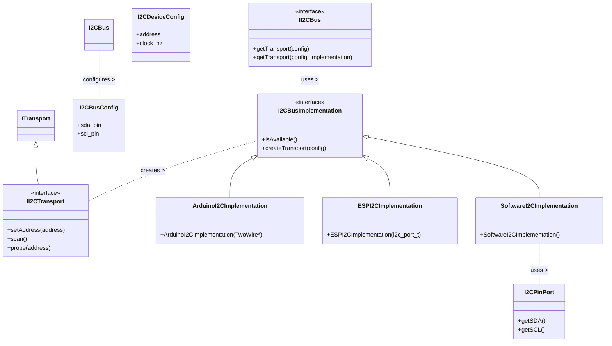
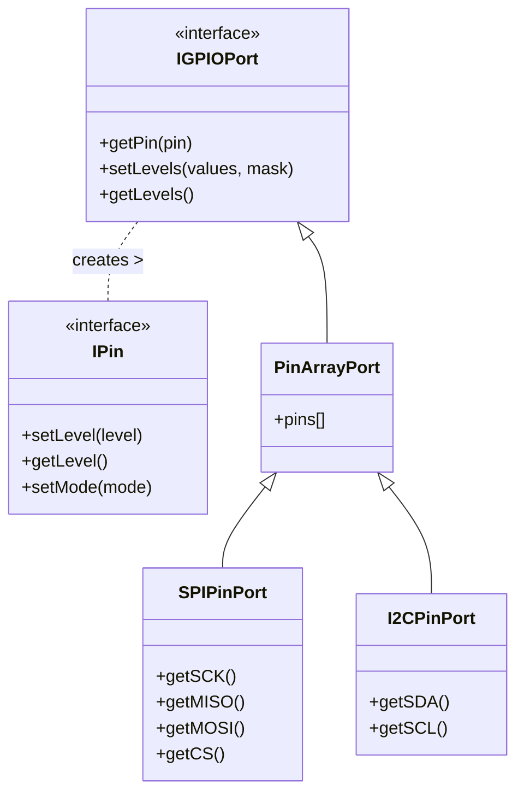

# FlexHAL 要件定義書

## 1. プロジェクト概要 🎯

FlexHALは、様々なマイコンプラットフォームで動作する柔軟なハードウェア抽象化レイヤー（HAL）です。

### 1.1 主な目的
- 様々なマイコンプラットフォームでの動作
- SDLを使用したデスクトップ環境でのエミュレーション
- ハードウェアに依存しない柔軟な実装

### 1.2 対応プラットフォーム
#### マイコン
- ESP32シリーズ
- ESP8266
- RP2040（Raspberry Pi Pico等）
- STM32シリーズ
- SPRESENSE
- SAMD21/SAMD51
- AVR（Arduino UNO等）

#### デスクトップ
- Windows
- macOS
- Linux（SDL2サポート環境）

### 1.3 対象ユーザー
- Arduinoを使用したことがある入門レベルの利用者
- ホビイスト・アマチュアレベルのユーザー

### 1.4 開発環境
- ArduinoIDE
- VSCode + PlatformIO
- ESP-IDF

## 2. 技術要件 ⚙️

### 2.1 インターフェース構造

#### 基本インターフェース構造



#### SPI通信構造



#### I2C通信構造



#### GPIO構造



#### 主要インターフェースの役割
- **IDevice**: すべてのデバイスの基底インターフェース
- **ITransport**: データ転送の抽象化
- **ISPITransport/II2CTransport**: バス固有のトランスポート機能
- **IGPIOPort**: GPIOポートの抽象化
- **IPin**: 単一ピンの抽象化
- **ISPIBus/II2CBus**: バス通信の抽象化
- **SPIBusImplementation/I2CBusImplementation**: バス実装の抽象化
- **SPIBusConfig/I2CBusConfig**: バス設定の保持
- **SPIDeviceConfig/I2CDeviceConfig**: デバイス固有設定の保持
- **SPIPinPort/I2CPinPort**: 特定用途向けGPIOグループ

### 2.2 APIデザイン
- シンプルで直感的なインターフェース
- Arduino互換の関数名を基本とする
- 内部実装ではモダンなC++機能を活用可能

### 2.3 ファイル構成と実装要件

#### ファイル構成

Arduino IDEなどでのビルド時間を短縮するため、以下のようなファイル構成を採用する：

```
FlexHAL/
├── src/
│   └── FlexHAL.h       # メインヘッダ（ユーザーがincludeするファイル）
├── impl/               # 実装をまとめるフォルダ（implementationの略）
│   ├── internal/       # 内部実装
│   │   ├── core.h
│   │   ├── spi.h
│   │   └── i2c.h
│   ├── platforms/      # ハードウェアプラットフォーム固有実装
│   │   ├── esp32/
│   │   ├── avr/
│   │   └── rp2040/
│   ├── frameworks/     # ソフトウェアフレームワーク固有実装
│   │   ├── arduino/
│   │   ├── espidf/
│   │   └── mbed/
│   └── rtos/           # RTOSレイヤー
│       ├── freertos/
│       ├── zephyr/
│       └── noos/       # RTOSなし用の実装
```

#### 実装階層

実装は以下の3つの階層に分けて管理する：

1. **プラットフォーム層**: ハードウェア固有の実装（ESP32, AVR, RP2040など）
2. **フレームワーク層**: ソフトウェアフレームワーク固有の実装（Arduino, ESP-IDF, Mbedなど）
3. **RTOS層**: RTOSの有無や種類に依存する実装（FreeRTOS, Zephyr, NoOSなど）

#### 自動検出

コンパイル時に適切な実装を自動選択するため、プリプロセッサによる環境検出を行う：

```cpp
// プラットフォーム検出 (ハードウェア)
#if defined(ESP32)
  #define FLEXHAL_PLATFORM_ESP32
#elif defined(__AVR__)
  #define FLEXHAL_PLATFORM_AVR
#endif

// フレームワーク検出 (ソフトウェア)
#if defined(ARDUINO)
  #define FLEXHAL_FRAMEWORK_ARDUINO
#elif defined(ESP_IDF_VERSION)
  #define FLEXHAL_FRAMEWORK_ESPIDF
#endif

// RTOSレイヤー検出
#if defined(configSUPPORT_DYNAMIC_ALLOCATION) // FreeRTOS
  #define FLEXHAL_RTOS_FREERTOS
#elif defined(CONFIG_ZEPHYR_VERSION)
  #define FLEXHAL_RTOS_ZEPHYR
#else
  #define FLEXHAL_RTOS_NONE
#endif
```

### 2.4 通信インターフェース
- 共通の基底インターフェース（ITransport）
- 送信・受信・送受信同時実行の基本操作
- 同期・非同期操作のサポート
- エラーハンドリングの統一

### 2.4 GPIO抽象化
- 単一ピン制御（IPin）
- ポート単位での制御（IGPIOPort）
- カスタムピングループの作成
- ハードウェア/ソフトウェア実装の柔軟な切り替え

### 2.5 バス通信
- SPIバス制御
- I2Cバス制御
- バスとデバイスの分離設計
- 専用GPIOポート型による役割の明確化

## 3. デバッグ機能 🔍

### 3.1 PCエミュレーション
- SDLによる画面表示
- マイコンとの通信ブリッジ機能
- シリアル/WiFi/BLE接続オプション

### 3.2 ブリッジ機能
- デフォルトはUSBシリアル通信
- 通信方式の実行時切り替え
- ユーザー独自の通信方式実装が可能

## 4. 実装方針 💫

### 4.1 抽象化レベル
- ハードウェアに依存しない抽象インターフェース
- プラットフォーム固有の実装を分離
- 拡張性を考慮した設計

### 4.2 エラーハンドリング
- 統一されたエラーコード体系
- 詳細なエラー情報の提供
- 非同期操作の状態管理

### 4.3 パフォーマンス
- 性能面での妥協なし
- ハードウェアペリフェラルの効率的な利用
- 低オーバーヘッドな実装

### 4.4 ビルド最適化
- srcフォルダのファイル数を最小限に抜える
- ヘッダオンリー実装の活用
- プリプロセッサマクロによる不要コードの除外
- プラットフォーム、フレームワーク、RTOSの3層分離構造

## 5. 品質基準 ✨

### 5.1 コード品質
- モダンC++の活用
- 一貫性のあるコーディングスタイル
- 適切なドキュメント化

### 5.2 テスト
- ユニットテストの実装
- 異なるプラットフォームでの動作確認
- エミュレーション環境でのテスト

### 5.3 パフォーマンス指標
- 低レイテンシー
- 最小限のメモリ使用
- 効率的なリソース利用
